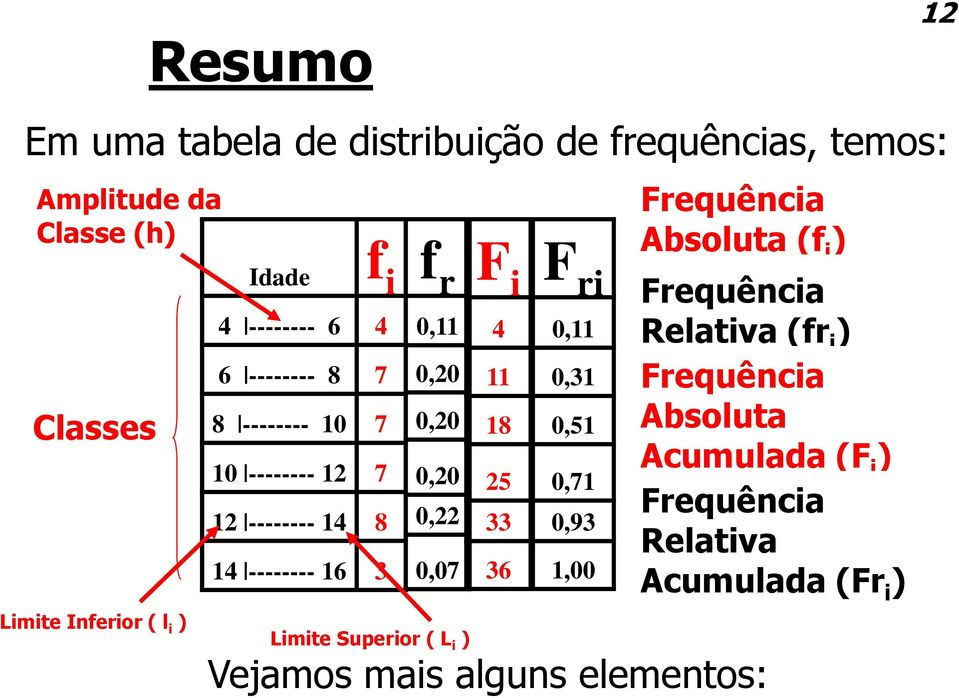

# Métodos Quantitativos para Ciências Sociais

### 01-07/02/21 Semana 1: Por que o pesquisador social utiliza a estatística?
  

    
Ver

<h4> A Pesquisa Social</h4>
Hipóteses são ideias que cientistas sociais têm da natureza da realidade social, normalmente manifestada em uma afirmação sobre a relação de no mínimo duas variáveis: dependente (efeito presumido) e independente (causa presumida). Testar uma hipótese é necessário para garantir a veracidade das observações  características de fenômenos e comportamentos sociais, para além de opiniões tendenciosas e inválidas, em grande parte baseado em experiências pessoais. Algumas formas de coletar dados em pesquisas sociais são:
<ul>
<li> <b>Experimento</b> - Em um experimento você tem um grupo homogêneo que é parte submetido a uma variável independente enquanto a outra parte do grupo não é. Um exemplo de experimento, é analisar os efeitos do microcrédito em uma região por meio do grupo de controle (sem crédito) e de experimental (com crédito);</li>
<li> <b>Survey</b> - Em um Survey, não se tem controle e os  indivíduos não são atribuídos a grupos aleatoriamente. Em um survey é difícil atribuir causa e efeito, porém consegue-se investigar mais variáveis independentes. Uma survey seria conduzir um formulário sobre empreendimento em uma região e a partir dos seus resultados avaliar relações e tomar conclusões;</li>
<li> <b>Análise de Conteúdo</b> - Em uma análise de conteúdo o pesquisador procura objetivamente descrever o conteúdo de mensagens previamente elaboradas, por meio de unitarização e categorização. Um exemplo seria análise de comentários políticos em redes sociais, ou um outro exemplo, que foi realizado em 2001, é análise de publicação em uma revista sobre celebridades;</li>
<li> <b>Observação Participativa</b> - Em uma observação participativa, o pesquisador participa da vida cotidiana das pessoas sujeitas ao estudo Essa pesquisa pode ser realizada abertamente, ou de maneira disfarçada, sem que os indivíduos tenham consciência do processo, a fim de não se enviesar o comportamento dos participantes, observando, Ela pode ser conduzida observando, ouvindo ou interrogando pessoas. Espera-se a captação das significações e das experiências subjetivas dos participantes. Um bom exemplo seria as pesquisas de observação no campo religioso brasileiro, onde se obtém informações mais ricas acerca da cultura religiosa da comunidade;</li>
</ul>
  
<h4> Niveis de Dados</h4>
Os dados em uma pesquisa social desempenham pelo menos 3 funções importantes para os pesquisadores de acordo com seu nível de mensuração, pode-se:
<ul>
<li>Classificar ou categorizar no <b>nível nominal</b> de mensuração - onde se dispõem os casos em categorias, de forma a cada caso corresponder a uma categoria, e conta-se sua frequência de ocorrência, sem serem de forma algum classificado, disposto ou escalonado por sua qualidade. Um exemplo seria ser beneficiario do auxílio emergencial ou não;</li>
<li>Ordenar por postos no <b>nível ordinal</b> de mensuração - quando se quer ordenar seus casos, de forma a permitir a ordenação de categorias mas não a magnitude das diferenças. Um exemplo seria a ordenação de nível de intolerância;</li>
<li>Atribuir um escore no <b>nível intervalar</b> de mensuração - no intervalar além da ordenação há a magnitude da diferença entre as escalas, como por exemplo a idade ou grau de nível de intolerância;</li>
</ul>
  
<h4> Estátistica</h4>
As duas principais funções primordiais empregabilidade da estatística, é de <b>descrição</b> e <b>tomada de decisão.</b> Quanto a <b>descrição</b>, consiste em por meio de dispositivos estatísticos, como gráficos e distribuição de frequência, detectar e descrever padrões ou tendências, de forma que os dados quantitativos se tornem convenientes termos descritivos. Já a <b>tomada de decisão,</b> é quando usamos os dispositivos estatísticos, para além da descrição, tornar inferências de amostras e assim validar ou não suas hipóteses.
  

  
### 08-14/02/21 Semana 2: Organização dos dados
  

    
Ver

<h4> Organização</h4> 

 
 

 
 

 
 

 
 

<h4> Tabulações cruzadas</h4>
Tabela que apresenta a distribuição (frequências e porcentagens) de uma variável (dependente) por categoria de uma ou mais variáveis(independentes). Se a variável independente está nas linhas, utilize a porcentagem por linha, se a variável independente está na coluna, utilize a porcentagem por coluna.
  

  
  
### 15-21/02/21 Semana 3: Medidas de tendência central
  

    
Ver

  

  
  
[DOC EXERCICIOS](https://docs.google.com/document/d/1U_d482gTjWEXyXpX_U_J7kgDzg9Rk21NnsbpjnP08Qs/edit?usp=sharing)
