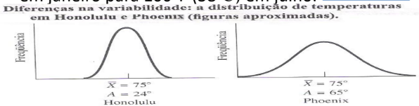

# Métodos Quantitativos para Ciências Sociais

## 01-07/02/21 Semana 1: Por que o pesquisador social utiliza a estatística?
  

    
Ver

<h3> A Pesquisa Social</h3>
Hipóteses são ideias que cientistas sociais têm da natureza da realidade social, normalmente manifestada em uma afirmação sobre a relação de no mínimo duas variáveis: dependente (efeito presumido) e independente (causa presumida). Testar uma hipótese é necessário para garantir a veracidade das observações  características de fenômenos e comportamentos sociais, para além de opiniões tendenciosas e inválidas, em grande parte baseado em experiências pessoais. Algumas formas de coletar dados em pesquisas sociais são:
<ul>
<li> <b>Experimento</b> - Em um experimento você tem um grupo homogêneo que é parte submetido a uma variável independente enquanto a outra parte do grupo não é. Um exemplo de experimento, é analisar os efeitos do microcrédito em uma região por meio do grupo de controle (sem crédito) e de experimental (com crédito);</li>
<li> <b>Survey</b> - Em um Survey, não se tem controle e os  indivíduos não são atribuídos a grupos aleatoriamente. Em um survey é difícil atribuir causa e efeito, porém consegue-se investigar mais variáveis independentes. Uma survey seria conduzir um formulário sobre empreendimento em uma região e a partir dos seus resultados avaliar relações e tomar conclusões;</li>
<li> <b>Análise de Conteúdo</b> - Em uma análise de conteúdo o pesquisador procura objetivamente descrever o conteúdo de mensagens previamente elaboradas, por meio de unitarização e categorização. Um exemplo seria análise de comentários políticos em redes sociais, ou um outro exemplo, que foi realizado em 2001, é análise de publicação em uma revista sobre celebridades;</li>
<li> <b>Observação Participativa</b> - Em uma observação participativa, o pesquisador participa da vida cotidiana das pessoas sujeitas ao estudo Essa pesquisa pode ser realizada abertamente, ou de maneira disfarçada, sem que os indivíduos tenham consciência do processo, a fim de não se enviesar o comportamento dos participantes, observando, Ela pode ser conduzida observando, ouvindo ou interrogando pessoas. Espera-se a captação das significações e das experiências subjetivas dos participantes. Um bom exemplo seria as pesquisas de observação no campo religioso brasileiro, onde se obtém informações mais ricas acerca da cultura religiosa da comunidade;</li>
</ul>
  
<h3> Niveis de Dados</h3>
Os dados em uma pesquisa social desempenham pelo menos 3 funções importantes para os pesquisadores de acordo com seu nível de mensuração, pode-se:
<ul>
<li>Classificar ou categorizar no <b>nível nominal</b> de mensuração - onde se dispõem os casos em categorias, de forma a cada caso corresponder a uma categoria, e conta-se sua frequência de ocorrência, sem serem de forma algum classificado, disposto ou escalonado por sua qualidade. Um exemplo seria ser beneficiario do auxílio emergencial ou não;</li>
<li>Ordenar por postos no <b>nível ordinal</b> de mensuração - quando se quer ordenar seus casos, de forma a permitir a ordenação de categorias mas não a magnitude das diferenças. Um exemplo seria a ordenação de nível de intolerância;</li>
<li>Atribuir um escore no <b>nível intervalar</b> de mensuração - no intervalar além da ordenação há a magnitude da diferença entre as escalas, como por exemplo a idade ou grau de nível de intolerância;</li>
</ul>
  
<h3> Estátistica</h3>
As duas principais funções primordiais empregabilidade da estatística, é de <b>descrição</b> e <b>tomada de decisão.</b> Quanto a <b>descrição</b>, consiste em por meio de dispositivos estatísticos, como gráficos e distribuição de frequência, detectar e descrever padrões ou tendências, de forma que os dados quantitativos se tornem convenientes termos descritivos. Já a <b>tomada de decisão,</b> é quando usamos os dispositivos estatísticos, para além da descrição, tornar inferências de amostras e assim validar ou não suas hipóteses.
  

  
  
  
  
## 08-14/02/21 Semana 2: Organização dos dados
  

    
Ver

<h3> Organização</h3> 

 
 

 
 

 
 

 
 

<h3> Tabulações cruzadas</h3>
Tabela que apresenta a distribuição (frequências e porcentagens) de uma variável (dependente) por categoria de uma ou mais variáveis(independentes). Se a variável independente está nas linhas, utilize a porcentagem por linha, se a variável independente está na coluna, utilize a porcentagem por coluna.
  

  
  
  
  
## 15-21/02/21 Semana 3: Medidas de tendência central
  

    
Ver

  <h3>Moda</h3>
<li> Categoria que ocorre com maior frequência em uma distribuição.
<li> Nível de mensuração: nominal, ordinal ou intervalar;
<li> Forma da distribuição: mais apropriada para bimodal;
<li> Objetivo: medida de tendência central simples, mas um tanto grosseira.
  <h3>Mediana</h3>
<li> Nível de mensuração: ordinal ou intervalar;
<li> Forma da distribuição: mais apropriada para assimetria acentuada;
<li> Objetivo: medida precisa de tendência central (eventualmente pode ser usada para separar distribuições em 2 categorias).
  
 
 Primeiro se deve encontrar onde está a mediana que estará em .
 N = Número de casos na distribuição;
 Fa = Frequência acumulada abaixo do limite inferior do intervalo crítico (intervalo de classe que contém a mediana);
 I = Abaixo do limite inferior do intervalo crítico;
 f = Frequência dentro do intervalo crítico;
 h = Tamanho do intervalo de classe.
  <h3>Média</h3>
<li> É a medida de tendência central mais utilizada.
<li> Nível de mensuração: intervalar;
<li> Forma da distribuição: mais apropriada para simetria unimodal;
<li> Objetivo: medida precisa de tendência central; frequentemente usada para operações estatísticas mais avançadas, inclusive em testes de tomada de decisão.
 
 
  <h3>Forma da distribuição dos dados</h3>
<li>Em uma distribuição unimodal perfeitamente simétrica a moda,a mediana,a média são idênticas.
<li>Em distribuição assimétrica, a mediana sempre se situa entre a moda e a média, e isso torna a mediana a medida mais conveniente de tendência central.
  

  

## 22-28/02/21 Semana 4: Medidas de variabilidade
  

    
Ver

    <h3>Variabilidade</h3>
<li> Isoladamente, as medidas de tendência central mostram um quadro incompleto dos dados. Além de uma medida de tendência central, precisamos de um índice de dispersão dos dados em torno do centro da distribuição. Exemplo: as temperaturas diárias de Honolulu (HI) e Phoenix (AZ), em média, têm 75oF (24oC). Elas seriam as mesmas em ambas cidades? Enquanto em Honolulu a variação de temperatura é de 70oF (21oC) a 80oF (27oC), Phoenix varia de 40oF (4oC) em janeiro para 100oF (38oC) em julho.
 
  <li> Veremos amplitude, desvio-médio, variância e desvio-padrão.
    <h3>Amplitude</h3>
<li> Para uma medida rápida de variabilidade podemos calcular a amplitude (A), a diferença entre o mais alto e o mais baixo escore em uma distribuição. <b>Vantagem</b>: cálculo rápido e fácil. <b>Desvantagem</b>: um dado extremo distorce a amplitude.
 
 A = amplitude;
 S = escore mais alto em uma distribuição;
 I = escore mais baixo em uma distribuição;
    <h3>Desvio-Médio</h3>
<li> Soma dos desvios absolutos dividido por N, medida de variabilidade matematicamente inadequada, mas com base segura para entender a variância.
 
 DM – Desvio médio;
 ∑|X – X_m| = Soma dos desvios absolutos;
 
 N = Número total de escores;
  <h3>Desvio-padrão</h3>
<li> O desvio-médio foi abandonado pelos pesquisadores em favor da variância e do desvio-padrão. O desvio-médio evita os números negativos, que se cancelam com os positivos. Isso gera problemas em análises mais sofisticadas.
<li> <b>Desvio-padrão</b> (raiz quadrada da variância)
 
 S = variância;
 ∑(X – X_m)^2 = Soma dos quadrados dos desvios em relação à média;
 N = Número total de escores;
 
<li> <b>Desvio-padrão - frequências simples</b>
 
 
 
<li> <b>Desvio-padrão - frequências agrupadas</b>
 
 
  

  
  
  
  
## 01-07/03/21 Semana 5: Probabilidade e a curva normal
  

    
Ver

  <h3>Probabilidade</h3>
  <li> A pedra angular da tomada de decisão (teste de hipóteses por meio de análise de dados) é a probabilidade.
  <h3>Curva Normal</h3>
  <li> A curva normal é um modelo teórico ou ideal obtido através de uma equação matemática e não de uma pesquisa ou coleta de dados, mas que tem aplicação efetiva em pesquisa.
  <li> Podemos calcular a distância de desvio padrão (σ) de qualquer escore bruto dado.
 
 μ = média de uma distribuição;
 σ = desvio-padrão de uma distribuição;
 z = escore padronizado;
 Depois verifica em uma tabela de z-score de probabilidade, que nem a que pode ser acesada em anexo.
  

  
  
## 08-14/03/21 Semana 6: Amostras e populações
  

    
Ver

  <h3>Probabilidade</h3>
A estatística amostral é o elo de ligação entre a Teoria das Probabilidades e a Inferência Estatística (a primeira é o instrumento de medida da segunda).
 
Na Teoria das Probabilidades buscam-se resultados gerais que possam ser aplicados a casos particulares; na Inferência Estatística buscam-se resultados particulares que se apliquem a casos gerais. As duas juntas evidenciam as relações entre as amostras e as populações de onde foram extraídas.
  <h3>Probabilidade</h3>
  
  
  
  
[DOC EXERCICIOS](https://docs.google.com/document/d/1U_d482gTjWEXyXpX_U_J7kgDzg9Rk21NnsbpjnP08Qs/edit?usp=sharing)
